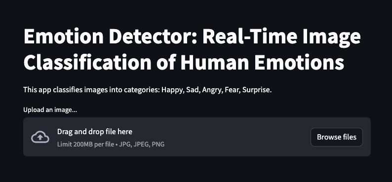

# Emotion Detector: Real-Time Image Classification of Human Emotions

## Project Overview

This project aims to develop a machine learning model capable of classifying human emotions from facial expressions. Utilizing advanced convolutional neural networks (CNNs), the model interprets images and categorizes emotions into five predefined classes: Happy, Sad, Angry, Fear, and Surprise. Integrated into a Streamlit web application, this project enables users to upload images and receive instant emotion classification results.

## Dataset Description

The dataset was curated using the "Download All Images - zip" Google Chrome extension, targeting images with specific emotion-related keywords. After downloading, images smaller than 10KB were manually removed to ensure high-quality and relevance. This curated collection forms the basis of our model training, focusing on a diverse representation of human emotions.

## Model Architecture

Our model employs a sequential architecture with three convolutional layers for feature extraction, each followed by max pooling. The convolutional layers progressively increase in depth, enhancing the model's ability to capture complex facial expressions. The architecture also includes dense layers, culminating in a softmax output layer for classification into the five emotional states. The model is compiled with Adam optimizer and sparse categorical crossentropy loss, emphasizing accuracy as the primary performance metric.

## Training the Model

Training involved 20 epochs with real-time monitoring via TensorBoard, facilitated by a dedicated callback. This setup allowed for insightful visualization of the training and validation processes, ensuring optimal model performance and generalization. The model's training and validation activities were rigorously documented, ensuring reproducibility and transparency.

## Model Evaluation

The model achieved perfect scores in accuracy, precision, and recall on the test dataset, an indicator of its exceptional performance. However, considerations around dataset representativeness and overfitting were taken into account, emphasizing the importance of real-world applicability and generalization.

## Model Deployment

The trained model was saved and integrated into a Streamlit web application, allowing users to upload images and receive emotion classifications in real time. The app demonstrates the model's practical utility and provides a platform for user interaction and feedback.

## Running the App

To interact with the model locally:

1. Clone the repository to your local machine.
2. Navigate to the directory containing `app.py`.
3. Run the app using Streamlit:
   ```
   streamlit run app.py
   ```
4. The app will open in your default web browser for you to upload images and view classifications.

   

## Conclusion and Future Work

While the model demonstrates high accuracy and performance, future work will focus on enriching the dataset, addressing potential overfitting, and enhancing the model's generalization capabilities. Deploying the app on a cloud platform and enabling continuous learning from new data and user interactions are also planned.

## References

- TensorFlow Documentation: [tf.keras.utils.image_dataset_from_directory](https://www.tensorflow.org/api_docs/python/tf/keras/utils/image_dataset_from_directory)
- TensorFlow Guide: [Sequential model](https://www.tensorflow.org/guide/keras/sequential_model)
- TensorFlow Metrics: [Sparse Categorical Accuracy](https://www.tensorflow.org/api_docs/python/tf/keras/metrics/SparseCategoricalAccuracy)

---
